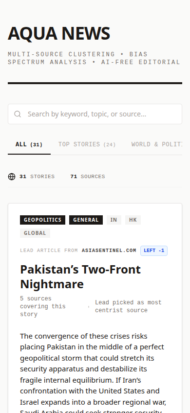

# aqua news

[](https://github.com/soubhik-ai/aqua-news/actions/workflows/ci.yml)
[](LICENSE)


Every news app shows you one side of a story. This one shows you all of them.

aqua news pulls articles from dozens of RSS feeds, figures out which ones are about the same story, and shows you where each source lands on the bias spectrum. The "lead" article is always the most centrist source. No AI-generated text, no hallucinated summaries. Just extractive NLP that pulls key sentences from real journalism.

I built this because I was tired of reading the same event described completely differently depending on which app I opened. Now I can see the full picture in one place.

<p align="center">
  
  
</p>

## how it works

```
RSS Feeds --> Acquisition --> Processing --> Analysis --> Dashboard
              (parallel       (TF-IDF +     (pick most    (Next.js +
               fetch +         DBSCAN        centrist      bias bar +
               clean text)     clustering)   source +      search +
                                             LexRank)      tabs)
```

1. **Acquisition** - fetches RSS feeds in parallel, extracts full article text with newspaper3k, deduplicates, strips boilerplate (cookie banners, subscription prompts, etc)

2. **Processing** - turns articles into TF-IDF vectors and clusters them with DBSCAN. articles about the same story end up in the same cluster.

3. **Analysis** - for each cluster, picks the least biased source as the lead, generates a 3-sentence summary using LexRank, computes bias stats across all sources

4. **Dashboard** - Next.js frontend with category tabs, search, pagination, and a bias spectrum bar for every story

## why not just use google news?

| | aqua news | Google News | Apple News | Ground News |
|---|---|---|---|---|
| open source | yes | no | no | no |
| bias spectrum per story | yes | no | no | partial |
| self-hostable | yes | no | no | no |
| no AI hallucination | yes (extractive only) | uses AI | uses AI | no summaries |
| custom sources | yes | no | no | no |
| free | yes | yes | freemium | freemium |

## quick start

### local dev (no cloud needed)

```bash
git clone https://github.com/soubhik-ai/aqua-news.git
cd aqua-news

# backend
pip install -r requirements.txt
python -c "import nltk; nltk.download('punkt'); nltk.download('punkt_tab')"

# set up your feeds
cp config/feeds.example.json config/feeds.json
# edit feeds.json with your preferred sources and bias scores

# run the pipeline
python src/fetcher.py

# frontend
cd frontend && npm install && npm run dev
```

### docker

```bash
cp config/feeds.example.json config/feeds.json
docker compose up
```

## configuration

### feeds

Your feeds live in `config/feeds.json`. See `config/feeds.example.json` for the format:

```json
{
  "url": "https://feeds.bbci.co.uk/news/world/rss.xml",
  "domain": "bbc.co.uk",
  "region": "GLOBAL",
  "category": "general",
  "bias_score": -1
}
```

`bias_score` is your call. -10 is far left, +10 is far right, 0 is center. The app picks the source closest to 0 as the lead for each story cluster. Disagree with a score? Change it.

### pipeline settings

| setting | default | what it does |
|---|---|---|
| `similarity_threshold` | 0.55 | how similar two articles need to be to get clustered together |
| `summary_sentences` | 3 | sentences per summary |
| `min_document_frequency` | 2 | min docs a term must appear in for TF-IDF |
| `max_articles_per_feed` | 20 | max articles per feed |

### env vars

| var | needed for | what |
|---|---|---|
| `GCS_BUCKET` | cloud deploy | GCS bucket for pipeline output |
| `GCS_BLOB` | no | blob name, defaults to `latest.json` |
| `FEEDS_SECRET` | cloud deploy | Secret Manager secret with your feeds.json |
| `GCP_PROJECT` | cloud deploy | your GCP project ID |

## project structure

```
src/
  acquisition.py      # RSS ingestion, text extraction, boilerplate filtering
  processing.py       # TF-IDF vectorization, DBSCAN clustering
  analysis.py         # lead selection, LexRank summarization, bias metrics
  fetcher.py          # pipeline orchestrator + caching + upload
frontend/
  app/page.tsx        # Next.js SSR page
  app/components/     # ClusterCard, BiasBar, ShareButtons, ClientHome
config/
  feeds.example.json  # example feed config (copy to feeds.json)
tests/                # pytest suite
mcp/
  server.py           # MCP server for AI assistants
Dockerfile            # frontend container
Dockerfile.fetcher    # pipeline container
docker-compose.yml    # both services
```

## deploying to cloud run

```bash
# create secrets
echo -n "your-bucket" | gcloud secrets create gcs-bucket --data-file=-
echo -n "latest.json" | gcloud secrets create gcs-blob --data-file=-
gcloud secrets create feeds-config --data-file=config/feeds.json

# deploy frontend
gcloud run deploy aqua-news \
  --source=. --port=3000 --allow-unauthenticated \
  --set-secrets="GCS_BUCKET=gcs-bucket:latest,GCS_BLOB=gcs-blob:latest"

# deploy fetcher as a job
gcloud run jobs deploy aqua-news-fetcher \
  --source=. --command="python" --args="src/fetcher.py" \
  --set-secrets="GCS_BUCKET=gcs-bucket:latest,GCS_BLOB=gcs-blob:latest,FEEDS_SECRET=feeds-config:latest"
```

## MCP server

There's an MCP server that lets AI assistants (Claude, etc) query the news data directly.

```bash
pip install -r mcp/requirements.txt
```

Add to Claude Desktop config:

```json
{
  "mcpServers": {
    "aqua-news": {
      "command": "python",
      "args": ["path/to/aqua-news/mcp/server.py"],
      "env": {
        "AQUA_NEWS_URL": "https://storage.googleapis.com/YOUR_BUCKET/latest.json"
      }
    }
  }
}
```

Three tools: `get_stories` (filter by category/region), `search_stories` (keyword search), `get_bias_analysis` (find the most polarizing or consensus stories). See [mcp/README.md](mcp/README.md) for details.

## tests

```bash
python -m pytest tests/ -v
```

## how bias scoring works

Every news source has a perspective. This project doesn't hide that, it quantifies it.

- Each feed gets a bias_score from -10 to +10
- You assign the scores based on your own judgment
- The lead article for each story is the one closest to center
- The bias bar shows where every source sits on the spectrum
- It's fully transparent and configurable

## roadmap

- [ ] per-article bias detection using NLP (not just per-source)
- [ ] sentiment analysis overlay
- [ ] feed health monitoring
- [ ] user accounts with personalized configs
- [ ] browser extension
- [ ] mobile app
- [ ] multi-language support
- [ ] webhook notifications for breaking clusters

## contributing

PRs welcome. See [CONTRIBUTING.md](CONTRIBUTING.md).

## license

[MIT](LICENSE)
