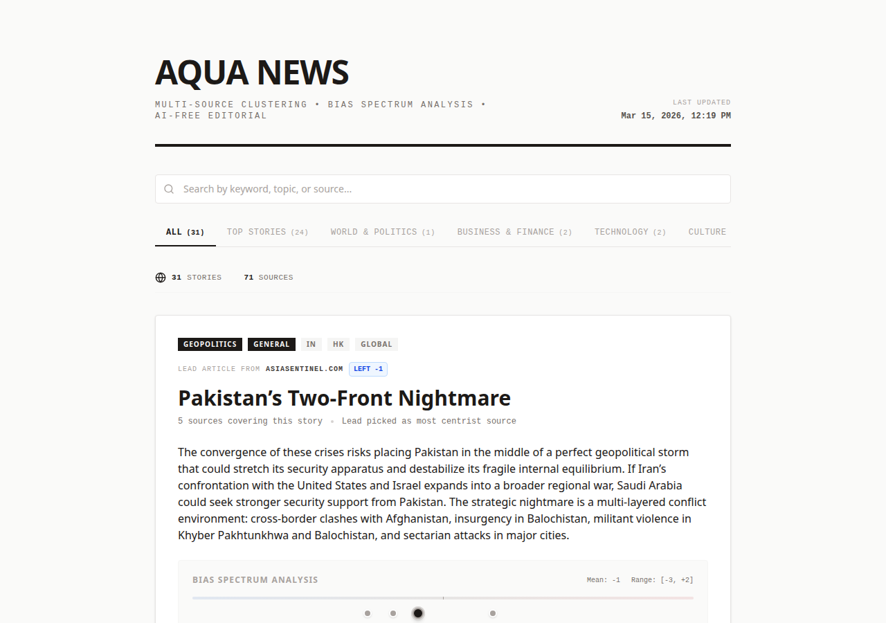

<p align="center">
  <h1 align="center">AQUA NEWS</h1>
  <p align="center">
    <strong>See the news from every angle.</strong><br>
    Open-source news aggregator that clusters stories across sources and exposes editorial bias.
  </p>
  <p align="center">
    <a href="https://github.com/soubhik-ai/aqua-news/actions/workflows/ci.yml"></a>
    <a href="https://github.com/soubhik-ai/aqua-news/blob/main/LICENSE"></a>
    
    
    <a href="https://github.com/soubhik-ai/aqua-news/stargazers"></a>
  </p>
</p>

---

Most news apps show you one perspective. Aqua News shows you **all of them** — then tells you where each one sits on the bias spectrum.

It ingests RSS feeds from dozens of sources across regions, clusters articles about the same story using NLP, picks the most centrist source as the lead, and visualizes the full bias distribution. No AI-generated summaries — just extractive summarization that pulls key sentences from real journalism.

<!-- TODO: Replace with actual screenshot -->
<!--  -->

## Why Aqua News?

| Feature | Aqua News | Google News | Apple News | Ground News |
|---------|-----------|-------------|------------|-------------|
| Open source | Yes | No | No | No |
| Bias spectrum per story | Yes | No | No | Partial |
| Self-hostable | Yes | No | No | No |
| No AI hallucination | Yes (extractive only) | Uses AI | Uses AI | No summaries |
| Custom feed sources | Yes | No | No | No |
| Free | Yes | Yes | Freemium | Freemium |

## How It Works

```
RSS Feeds (configurable)
       |
       v
 ┌─────────────┐     ┌──────────────┐     ┌──────────────┐
 │ Acquisition  │────>│  Processing  │────>│   Analysis   │
 │  parallel    │     │  TF-IDF +    │     │  lead pick + │
 │  fetch +     │     │  DBSCAN      │     │  LexRank     │
 │  clean text  │     │  clustering  │     │  summarize   │
 └─────────────┘     └──────────────┘     └──────────────┘
       |                                         |
       v                                         v
  Local daily cache                        JSON output
  (fetch once/day)                              |
                                                v
                                         ┌──────────────┐
                                         │   Next.js    │
                                         │  Dashboard   │
                                         └──────────────┘
```

1. **Acquisition** — Parses RSS feeds in parallel, extracts full article text via newspaper3k, deduplicates by URL, strips per-domain boilerplate, rejects garbage content.

2. **Processing** — Builds TF-IDF vectors from article texts and clusters them using DBSCAN on cosine similarity. Articles covering the same story get grouped together.

3. **Analysis** — For each cluster: picks the least-biased article as lead, generates a 3-sentence extractive summary using LexRank, computes bias distribution metrics.

4. **Dashboard** — Next.js frontend with category tabs, search, pagination, bias spectrum visualization per story, and share buttons.

## Quick Start

### Local development (no cloud required)

```bash
# Clone
git clone https://github.com/soubhik-ai/aqua-news.git
cd aqua-news

# Backend
pip install -r requirements.txt
python -c "import nltk; nltk.download('punkt'); nltk.download('punkt_tab')"

# Copy and customize your feeds
cp config/feeds.example.json config/feeds.json
# Edit config/feeds.json with your preferred sources and bias scores

# Run the pipeline (outputs to local cache)
python src/fetcher.py

# Frontend
cd frontend && npm install && npm run dev
```

### Docker

```bash
cp config/feeds.example.json config/feeds.json
docker compose up
```

### Cloud deployment (GCP)

See [Deployment Guide](#deployment) below for Cloud Run + Secret Manager setup.

## Configuration

### Feed sources

Define your sources in `config/feeds.json` (see `config/feeds.example.json` for the format):

```json
{
  "feeds": [
    {
      "url": "https://feeds.bbci.co.uk/news/world/rss.xml",
      "domain": "bbc.co.uk",
      "region": "GLOBAL",
      "category": "general",
      "bias_score": -1
    }
  ],
  "settings": {
    "similarity_threshold": 0.55,
    "summary_sentences": 3,
    "min_document_frequency": 2,
    "max_articles_per_feed": 20
  }
}
```

| Field | Description |
|-------|-------------|
| `url` | RSS feed URL |
| `domain` | Display name for the source |
| `region` | `IN`, `HK`, `GLOBAL`, or any custom region |
| `category` | `general`, `finance`, `geopolitics`, `science`, `technology`, `culture` |
| `bias_score` | -10 (far left) to +10 (far right) — your editorial judgment |

### Pipeline settings

| Setting | Default | Description |
|---------|---------|-------------|
| `similarity_threshold` | 0.55 | Cosine similarity needed to cluster two articles together |
| `summary_sentences` | 3 | Sentences per cluster summary |
| `min_document_frequency` | 2 | Min documents a term must appear in for TF-IDF |
| `max_articles_per_feed` | 20 | Max articles fetched per RSS feed |

### Environment variables

| Variable | Required | Description |
|----------|----------|-------------|
| `GCS_BUCKET` | For cloud deploy | GCS bucket name for storing pipeline output |
| `GCS_BLOB` | No | Blob name (default: `latest.json`) |
| `FEEDS_SECRET` | For cloud deploy | GCP Secret Manager secret name containing feeds.json |
| `GCP_PROJECT` | For cloud deploy | GCP project ID |

## Project Structure

```
src/
  acquisition.py      # RSS ingestion, text extraction, boilerplate filtering
  processing.py       # TF-IDF vectorization, DBSCAN clustering
  analysis.py         # Lead selection, LexRank summarization, bias metrics
  fetcher.py          # Pipeline orchestrator + caching + upload
frontend/
  app/page.tsx        # Next.js entry point (SSR from GCS)
  app/components/     # ClusterCard, BiasBar, ShareButtons, ClientHome
config/
  feeds.example.json  # Example feed config (copy to feeds.json)
tests/                # pytest suite
Dockerfile            # Next.js frontend container
Dockerfile.fetcher    # Python pipeline container
docker-compose.yml    # Both services
```

## Deployment

### Google Cloud Run

```bash
# 1. Create secrets
echo -n "your-bucket" | gcloud secrets create gcs-bucket --data-file=-
echo -n "latest.json" | gcloud secrets create gcs-blob --data-file=-
gcloud secrets create feeds-config --data-file=config/feeds.json

# 2. Deploy frontend
gcloud run deploy aqua-news \
  --source=. \
  --port=3000 \
  --allow-unauthenticated \
  --set-secrets="GCS_BUCKET=gcs-bucket:latest,GCS_BLOB=gcs-blob:latest"

# 3. Deploy fetcher as a job
gcloud run jobs deploy aqua-news-fetcher \
  --source=. \
  --command="python" --args="src/fetcher.py" \
  --set-secrets="GCS_BUCKET=gcs-bucket:latest,GCS_BLOB=gcs-blob:latest,FEEDS_SECRET=feeds-config:latest"

# 4. Schedule the fetcher (daily)
gcloud scheduler jobs create http aqua-news-daily \
  --schedule="0 6 * * *" \
  --uri="https://REGION-run.googleapis.com/apis/run.googleapis.com/v1/namespaces/PROJECT/jobs/aqua-news-fetcher:run" \
  --http-method=POST
```

## Testing

```bash
python -m pytest tests/ -v
```

## Bias Methodology

Every news source has an editorial perspective. Aqua News doesn't hide this — it quantifies it.

- Each feed gets a `bias_score` from -10 (far left) to +10 (far right)
- Scores are assigned by the instance operator (you) based on your assessment
- The **lead article** for each story cluster is the source closest to center (lowest `|bias_score|`)
- The **bias bar** shows where every source in the cluster falls on the spectrum
- This is transparent and configurable — disagree with a score? Change it

## Roadmap

- [ ] Per-article bias detection using NLP (not just per-source)
- [ ] Sentiment analysis overlay on bias spectrum
- [ ] RSS feed health monitoring dashboard
- [ ] User accounts with personalized feed configs
- [ ] Browser extension for inline bias context
- [ ] Mobile app (React Native)
- [ ] Multi-language support
- [ ] Webhook notifications for breaking story clusters

## Contributing

Contributions are welcome! Please read [CONTRIBUTING.md](CONTRIBUTING.md) before submitting a PR.

## License

[MIT](LICENSE) - Use it however you want.
